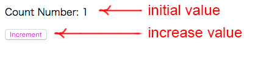

# React with webpack and express
I tried to connect Client-side and Server-side React with ECMAScript on React + Express + webpack.<br>
This is the example how to run React component through express rewuest, response concept.<br>
After the process of server side rendering, I tried to render the same component at the client side.<br>

## ✅ Requirements
Babel 7<br>
node v8.9.4<br>
npm (v5.6.0)<br>
webpack@4.35.2<br>

## Sample
This is just simple example, that you can click button to increase the number from initial value.<br>
<br>

## Usage
After clone or download to your certain directory:<br>
Go to directory and type this command under your console.<br>

```bash
# Install package.json
$ npm install

# To compile and bundle all tasks with webpack
npm run build
# or
./node_modules/.bin/webpack

# To start server
npm start
# or
node_modules/.bin/babel-node src/server.js
```

## 👤 Author
- Github: [aricomo](https://github.com/aricomo)

## 📝 License
This software is released under the MIT License.
